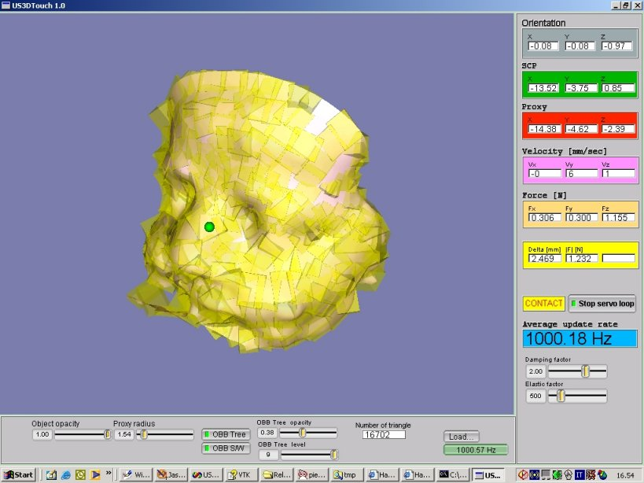

These are two applications I developed as part of my **Master’s thesis project** back in **2002** ([link to thesis](img/FeTouch-Tesi.pdf)). I recently found the original source code on one of my hard drives and thought it was worth sharing.

I’m planning to update the project so it can compile and run on macOS and Linux. After that, my goal is to port both applications to **Rust** and build a **Rust-based haptics library** that other developers can use to create haptic applications.

